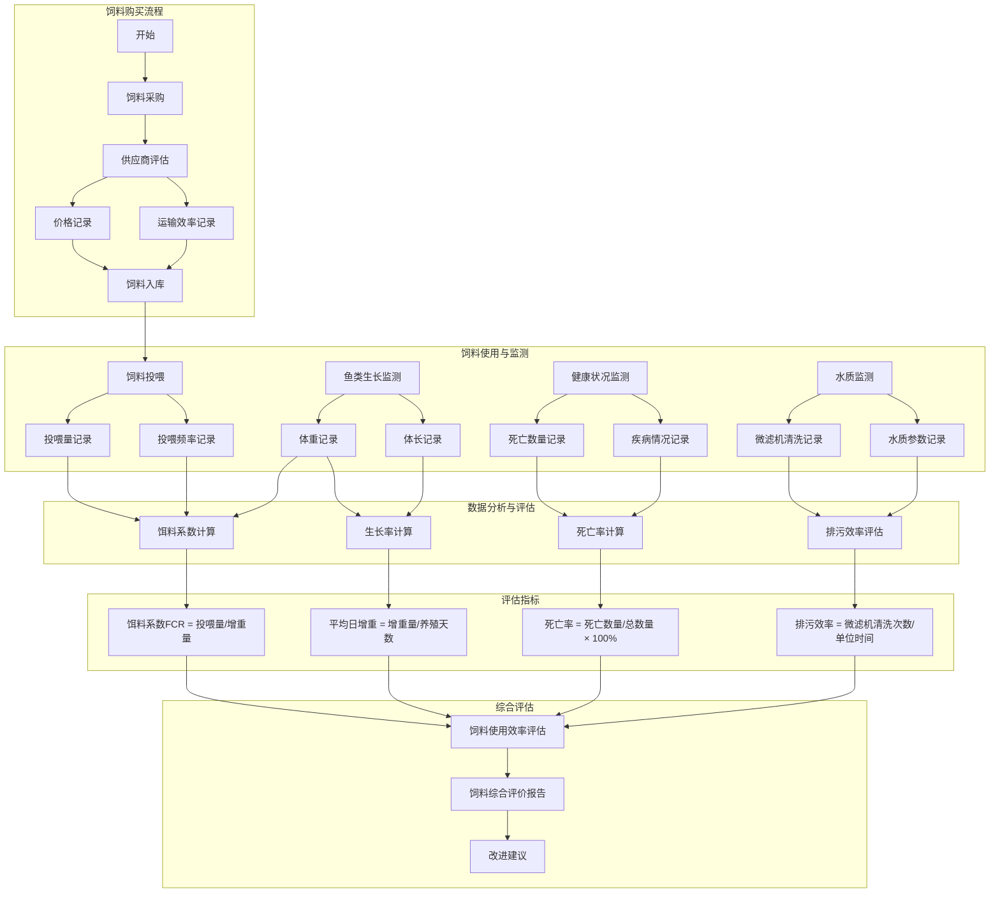

```mermaid
graph TD
    subgraph 饲料购买流程
        A[开始] --> B[饲料采购]
        B --> C[供应商评估]
        C --> D[价格记录]
        C --> E[运输效率记录]
        D --> F[饲料入库]
        E --> F
    end
    
    subgraph 饲料使用与监测
        F --> G[饲料投喂]
        G --> H[投喂量记录]
        G --> I[投喂频率记录]
        
        J[鱼类生长监测] --> K[体重记录]
        J --> L[体长记录]
        
        M[健康状况监测] --> N[死亡数量记录]
        M --> O[疾病情况记录]
        
        P[水质监测] --> Q[微滤机清洗记录]
        P --> R[水质参数记录]
    end
    
    subgraph 数据分析与评估
        H --> S[饵料系数计算]
        I --> S
        K --> S
        
        K --> T[生长率计算]
        L --> T
        
        N --> U[死亡率计算]
        O --> U
        
        Q --> V[排污效率评估]
        R --> V
    end
    
    subgraph 评估指标
        S --> W[饵料系数FCR = 投喂量/增重量]
        T --> X[平均日增重 = 增重量/养殖天数]
        U --> Y[死亡率 = 死亡数量/总数量 × 100%]
        V --> Z[排污效率 = 微滤机清洗次数/单位时间]
    end
    
    subgraph 综合评估
        W --> AA[饲料使用效率评估]
        X --> AA
        Y --> AA
        Z --> AA
        AA --> AB[饲料综合评价报告]
        AB --> AC[改进建议]
    end
```